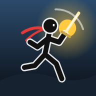

# Stickman Odyssey

A stickman action-adventure built for phones. Travel a world map across six lands,
fight through side-scrolling stages full of enemies and hazards, beat six bosses,
and upgrade your hero along the way. It is a single HTML file with no downloads,
no ads and no internet needed once it's on your device.



> **Also in this repository: [Crown Duel](crown-duel/)**, a real-time card battle game for
> phones. Battle the AI offline or duel a friend online with a room code. Once GitHub Pages
> is on, it lives at `https://<your-user>.github.io/<repo>/crown-duel/`.

## Play it on your phone

### Option A — install it like an app (recommended, works offline)

1. Turn on GitHub Pages for this repository: **Settings → Pages → Build and deployment →
   Source: "Deploy from a branch"**, pick the branch that holds this game and the
   `/ (root)` folder, then **Save**.
2. After a minute the game is live at `https://<your-user>.github.io/<repo>/`.
3. Open that link on your phone:
   - **Android (Chrome):** tap **Install app** on the title screen (or menu ⋮ → *Install app* / *Add to Home screen*).
   - **iPhone (Safari):** tap **Share → Add to Home Screen**.
4. Launch it from the home-screen icon. It opens full screen in landscape and keeps
   working with no connection (a service worker caches everything on first launch).

### Option B — just download the file

`index.html` is completely self-contained (all code, graphics and sound are generated in
the file). Download it and open it in a mobile browser such as Chrome or Firefox. Your
progress is saved in the browser automatically.

> Tip: hold the phone sideways. The game works in portrait too, but landscape is much better.

## Controls

| Touch | Keyboard | Action |
| --- | --- | --- |
| Drag on the left half of the screen | Arrows / WASD | Move (joystick). Push up/down for special moves |
| **ATTACK** (big button) | J / X | 3-hit combo — hold to keep attacking |
| **JUMP** | Space / K | Jump, tap again mid-air to double jump |
| **>>** | L / Shift | Dash (invincible while dashing) |
| **S1 / S2** | I / O | Special skills (use energy) |
| Flask (top-left) | Q | Drink a potion (heals 50%) |
| Pause (top-right) | Esc | Pause menu |

Game controllers are supported too (A jump, X attack, B dash, Y/RB skills, LB potion, Start pause).

**Moves**

- **Up + Attack** — uppercut launcher (then follow up in the air to juggle)
- **Attack in the air** — spinning air attack (up to 3 per jump)
- **Down + Attack in the air** — ground slam with a shockwave
- **Dash + Attack** — dash strike (breaks guards)
- **Down + Jump** on a wooden plank — drop through it
- Hit arrows, orbs and shurikens to destroy them; hit a bomb to knock it back at enemies

## What's in the game

- **World map with travelling**: 6 regions — Green Meadows, Whispering Woods, Scorching
  Dunes, Frostpeak Mountains, Ember Volcano and the Shadow Citadel — with 36 places to
  visit: towns with shops, 18 main stages, treasure stages, challenge arenas, 6 boss lairs
  and the endless **Grand Colosseum**. Random road events happen while you travel
  (ambushes, hidden stashes, a wandering merchant, ancient shrines).
- **Combat**: combos, launchers, air juggles, slams, dash-cancels, critical hits, a hit
  counter with combo bonuses, guard breaks, projectile deflection, hit-stop and screen shake.
- **18 enemy types**: grunts, swordsmen, archers, shield guards, brutes, yetis, bats,
  frost bats, imps, ninjas, bombers, mages, slimes, spiders, scorpions, mummies, dark
  knights and shadow clones — each with its own AI.
- **6 bosses** with unique attack patterns, a stagger meter and an enraged second phase:
  Big Bruto, Arachna the spider queen, Seth-Ra the pharaoh, Glacius the frost colossus,
  Ignivore the dragon and the Shadow Lord.
- **6 weapons** (fists, sword, spear, war hammer, katana, cosmic blade) that each change
  your moveset, **6 skills** (energy blast, ground quake, whirlwind, thunder, frost nova,
  meteor rain) won from bosses, 5 stat upgrades, potions, levels and XP.
- **Stage elements**: moving platforms, lifts, falling platforms, springs, rope bridges,
  one-way planks, spikes, lava, saw blades, fire vents, falling icicles, slippery ice,
  crates, treasure chests, gems, checkpoints and wave-based arena lock-ins.
- S/A/B/C ranks for every stage, automatic saving, synthesized music for every region.

## Development

The source lives in `src/` and is bundled into the single-file `index.html`:

```bash
node build.mjs            # bundle src/ -> index.html and stamp sw.js
```

- `src/index.template.html` — page shell and CSS
- `src/js/*.js` — game modules (concatenated in file-name order)
- `src/sw.template.js` — offline service worker template

Test tools (need Playwright with Chromium):

```bash
NODE_PATH=$(npm root -g) node tools/smoke-test.cjs [screenshot-dir]  # bot plays every stage type and boss
NODE_PATH=$(npm root -g) node tools/check-levels.cjs                 # proves every generated stage is completable
NODE_PATH=$(npm root -g) node tools/make-icons.cjs                   # regenerates the app icons
```

---

## 한국어 안내

**Stickman Odyssey(스틱맨 오디세이)** 는 휴대폰으로 편하게 할 수 있는 오프라인 스틱맨 액션 어드벤처 게임입니다.

- **설치해서 하기 (추천):** 저장소 **Settings → Pages** 에서 이 게임이 있는 브랜치와 `/ (root)` 를 선택해 저장하면
  `https://<사용자명>.github.io/<저장소>/` 주소가 생깁니다. 휴대폰으로 열고
  안드로이드는 **앱 설치**, 아이폰은 **공유 → 홈 화면에 추가** 를 누르면 인터넷 없이도 실행됩니다.
- **파일로 하기:** `index.html` 하나에 게임 전체가 들어 있으니, 내려받아 모바일 브라우저(크롬 등)로 열면 됩니다.
- **조작:** 화면 왼쪽을 드래그해서 이동, 오른쪽 버튼으로 공격·점프·대시·스킬. 휴대폰을 가로로 들고 하세요.
- **다른 게임:** 같은 저장소의 [`crown-duel/`](crown-duel/) 폴더에 실시간 카드 대전 게임 **Crown Duel(크라운 듀얼)** 이 있습니다.
  오프라인으로 AI와 대전하거나, 방 코드로 친구와 온라인 대전을 할 수 있습니다.
