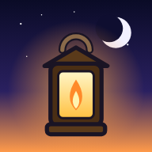

# Dawnkeeper

A roguelite survivor game for phones. You are a lantern keeper who has to survive one night
against an ever-growing horde. Move with one thumb, your weapons fire on their own, and every
level-up gives you a choice. Last until dawn and beat the master of the night to win. It is a
single HTML file: no downloads, no ads, no accounts, and no internet needed once it's on your device.



## Play it on your phone

### Option A: install it like an app (recommended, works offline)

1. Turn on GitHub Pages for this repository: **Settings → Pages → Build and deployment →
   Source: "Deploy from a branch"**, pick the branch that holds this game and the
   `/ (root)` folder, then **Save**.
2. After a minute the game is live at `https://<your-user>.github.io/<repo>/dawnkeeper/`.
3. Open that link on your phone:
   - **Android (Chrome):** tap **Install app** on the home screen of the game (or menu ⋮ →
     **Install app** / **Add to Home screen**).
   - **iPhone (Safari):** **Share → Add to Home Screen**.
4. Launch it from the home-screen icon. It opens full screen and keeps working with no
   connection. A service worker caches everything on first launch.

### Option B: just download the file

`index.html` is completely self-contained (all code, graphics and sound are generated in the
file). Download it and open it in a mobile browser. Progress is saved in the browser.

> Hold the phone upright. Landscape, tablets and desktops work too.

## How to play

| Touch | Keyboard / gamepad | Action |
| --- | --- | --- |
| Drag anywhere on the screen | WASD / arrows / left stick | Move. The joystick appears under your thumb |
| (nothing) | (nothing) | Your weapons attack automatically |
| Pause button (top right) | Esc / P / Start | Pause, see your build, settings, give up |

- Defeated monsters drop **experience gems**. Walk near them to collect them.
- Every **level up** you pick one of 3 (sometimes 4) cards: a new weapon, a new item, or an
  upgrade. You can carry **6 weapons and 6 items**.
- **Elites** (glowing gold) and **bosses** drop **treasure chests** with free upgrades.
- **Evolutions:** raise a weapon to level 8 while you own its matching item, then open a chest.
  The weapon evolves into a much stronger form. The level-up cards tell you which item each
  weapon needs.
- Smash **lantern posts** for hearts, gold, magnets (pull in every gem) and holy bombs
  (wipe the screen).
- Mini-bosses arrive at **5:00** and **10:00**. At **15:00** the master of the night appears.
  Beat it and the dawn breaks: you win.
- Gold from every run buys permanent **Power-ups**. Achievements unlock new heroes, weapons
  and stages.

## Modes

| Mode | What it is |
| --- | --- |
| **Full Night** | The real thing: 15 minutes, three bosses, the dawn. Clearing a stage unlocks the next one. |
| **Quick Night** | The same night squeezed into 5 minutes. Faster levels, weaker monsters, less gold. |
| **Endless** | Unlocked per stage once you clear it. The night never ends and bosses keep coming. |
| **Daily Night** | A new challenge every day: a fixed stage, hero and two twists (for example *Swarming Night* or *Glass Lantern*). First finish of the day gives bonus gold. |

## What's in the game

- **12 weapons**, each with 8 levels and an **evolution** (24 in total): Magic Bolt → Arcane
  Storm, Lantern Slash → Dawnbreaker, Orbiting Blades → Eternal Halo, Holy Aura → Sanctuary,
  Boomerang → Twin Moons, Chain Lightning → Tempest, Fire Flask → Inferno, Frost Nova →
  Absolute Zero, Ricochet Orb → Prism Storm, Sweeping Beam → Solar Lance, Seeker Drones →
  Hive Swarm, Spike Runes → Glyph Field.
- **12 items** (damage, cooldown, area, duration, extra projectiles, speed, health,
  regeneration, magnet, luck, armor, projectile speed).
- **4 stages** with their own monsters, music and hazards: Moonlit Graveyard, Frozen Wastes
  (blizzards push you around), Ember Caverns (lava vents erupt under everyone) and Void
  Citadel (drifting void rifts).
- **19 monster types** with their own behaviour: bat swarms, hopping slimes that split,
  charging hellhounds, exploding bloaters, shield knights that block from the front,
  necromancers that raise skeletons, blinking shades, archers, yetis and imps that shoot.
  Plus swarms that sweep across the screen, rings that close in, and golden elites.
- **12 bosses** with telegraphed slams, dashes, projectile rings, spirals, volleys,
  summons, teleports and an enraged second phase.
- **6 heroes** with their own starting weapon and perk: Lumen, Aria, Bram, Kira, Vesper, Orin.
- **17 power-ups** to buy with gold (refund any time), **27 achievements**, a codex of
  weapons, items and monsters, rerolls, skips and banishes.
- Synthesized music for every stage that gets more intense as the night goes on, sound
  effects (gem pickups rise in pitch as you chain them), vibration, damage numbers and
  screen shake. Graphics quality drops automatically on slower phones.

## Development

The source lives in `src/` and is bundled into the single-file `index.html`:

```bash
node dawnkeeper/build.mjs   # bundle src/ -> index.html and stamp sw.js
```

- `src/index.template.html`: page shell and CSS
- `src/js/*.js`: game modules, concatenated in file-name order (`05-run.js` is the run
  simulation, `06-weapons.js` the weapons, `07-enemies.js` monsters, bosses and the wave
  director, `08-bot.js` the autopilot used by the tests, `11-view.js` the renderer)
- `src/sw.template.js`: offline service worker template

Tests and tools (Playwright with Chromium):

```bash
node dawnkeeper/tools/sim-test.cjs 3 [--power=0|mid|max] [--quick]          # autopilot runs in Node: crashes, NaN, balance numbers
NODE_PATH=$(npm root -g) node dawnkeeper/tools/smoke-test.cjs [shots-dir]   # every menu, a run, level-ups, chest, boss, frame rate, results
NODE_PATH=$(npm root -g) node dawnkeeper/tools/make-icons.cjs               # regenerates the app icons
```

---

## 한국어 안내

**Dawnkeeper(던키퍼)** 는 휴대폰으로 즐기는 로그라이트 서바이버 게임입니다.
등불지기가 되어 끝없이 몰려오는 괴물들 사이에서 하룻밤을 버티세요. 한 손가락으로 움직이기만 하면
무기는 알아서 공격하고, 레벨이 오를 때마다 새 무기·아이템·강화 중 하나를 고릅니다.
15분을 버티고 밤의 주인을 쓰러뜨리면 새벽이 밝아오며 승리합니다.

- **조작:** 화면 아무 곳이나 드래그하면 그 자리에 조이스틱이 생깁니다. 공격은 자동입니다.
- **성장:** 쓰러뜨린 적이 떨어뜨리는 경험치 보석을 모아 레벨업하세요. 무기 6개, 아이템 6개까지 가질 수 있습니다.
- **진화:** 무기를 8레벨까지 올리고 짝이 되는 아이템을 가진 채 상자를 열면 무기가 훨씬 강하게 진화합니다.
  (레벨업 카드에 필요한 아이템이 표시됩니다.)
- **보스:** 5분, 10분에 중간 보스, 15분에 최종 보스가 나옵니다. 금빛 정예 몬스터와 보스는 보물 상자를 떨어뜨립니다.
- **영구 강화:** 판마다 모은 골드로 파워업을 사서 점점 강해집니다. 업적을 달성하면 새 영웅·무기·스테이지가 열립니다.
- **모드:** 15분 정식 모드, 5분 빠른 모드, 스테이지 클리어 후 열리는 무한 모드, 매일 바뀌는 **오늘의 밤** 도전.
- **설치해서 하기 (추천):** 저장소 **Settings → Pages** 에서 이 게임이 있는 브랜치와 `/ (root)` 를 선택해 저장하면
  `https://<사용자명>.github.io/<저장소>/dawnkeeper/` 주소가 생깁니다. 휴대폰으로 열고
  안드로이드는 **앱 설치**, 아이폰은 **공유 → 홈 화면에 추가** 를 누르면 인터넷 없이도 실행됩니다.
- **파일로 하기:** `index.html` 하나에 게임 전체가 들어 있으니, 내려받아 모바일 브라우저로 열어도 됩니다.
- 휴대폰을 세로로 들고 하세요. 가로 화면, 태블릿, PC에서도 동작합니다.
